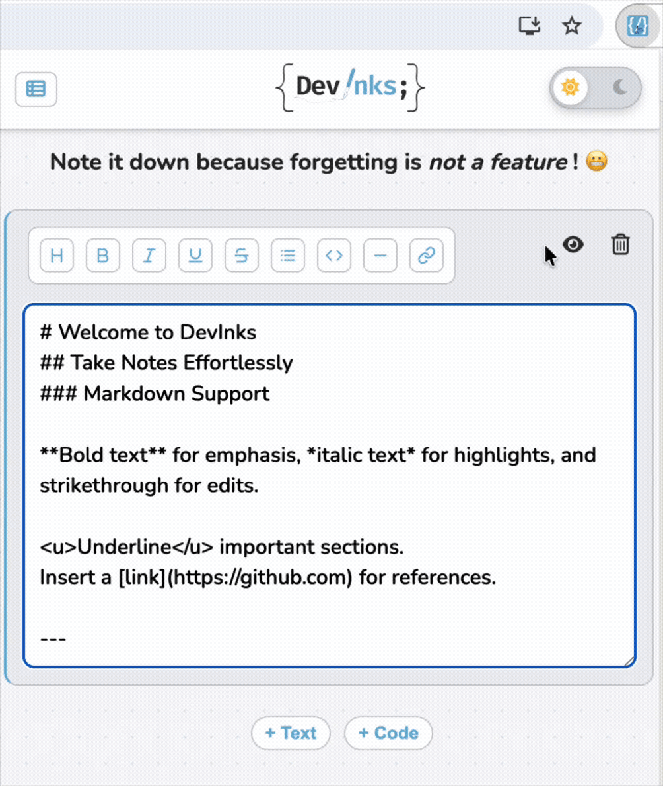
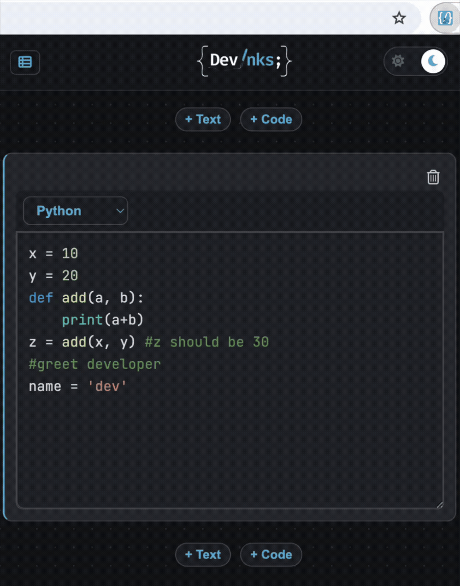
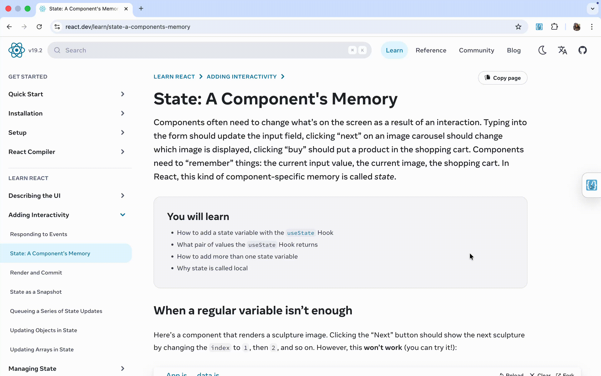
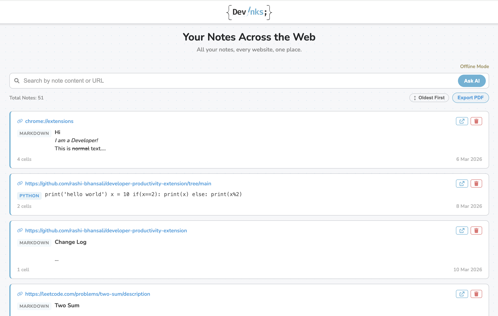
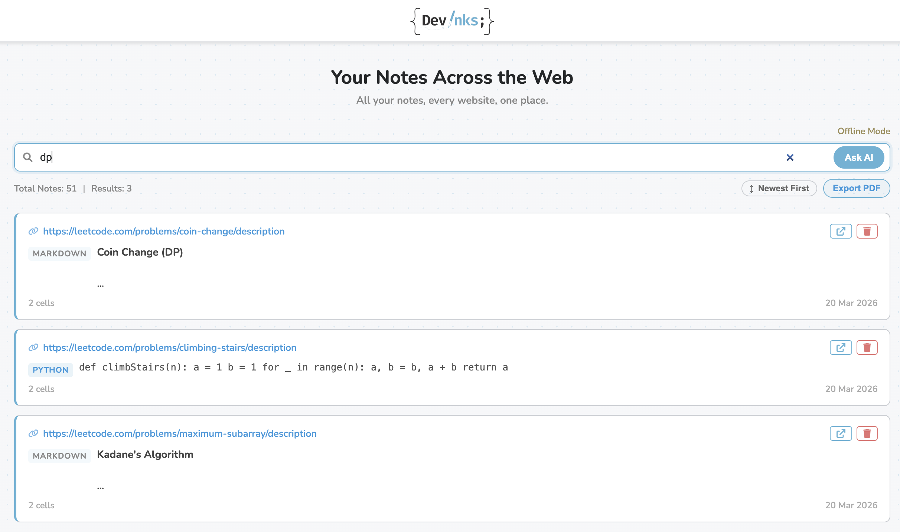
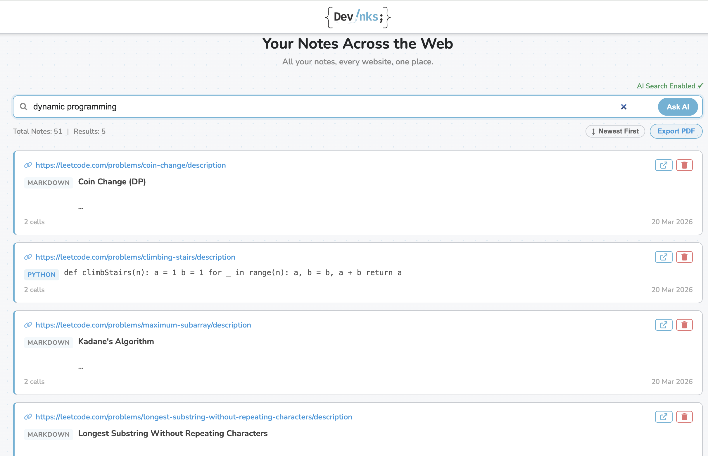
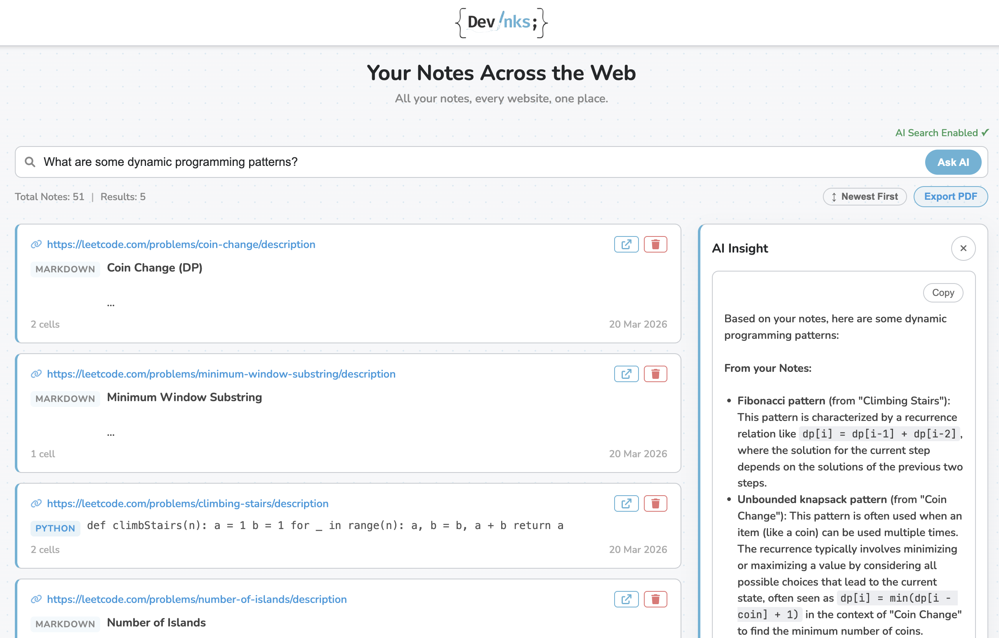

# DevInks Chrome Extension

<p align="center">
  
</p>

DevInks is a **local-first Chrome extension** for capturing **markdown notes** and **code snippets** directly in context. It opens from a lightweight page launcher into a persistent **Chrome side panel** and includes a centralized **dashboard** to search, sort, export, and manage notes across websites. An optional backend adds **semantic search** and **AI-powered note synthesis**.

## Overview

DevInks enables developers to:

- Take **markdown** and **code** notes directly on any webpage
- Persist notes **per URL** using **IndexedDB**
- View and manage all notes from a centralized **dashboard**
- **Search**, **sort**, and **export** notes
- Use **semantic search** and **Ask AI** with an optional local backend

## Features

### In-Page Note Taking

- Add **Markdown** and **Code** cells on any webpage
- Supports **Python**, **JavaScript**, and **C++**
- Toggle between _raw_ and _rendered_ markdown




### Side Panel Experience

Notes stay accessible in a persistent **side panel**, so you can keep browsing while writing or editing.




### Notes Dashboard

A full-page dashboard to manage all notes across websites.

- View note previews and metadata
- Navigate back to source URLs
- Delete notes
- Track **total notes**



### Search and Sorting

- **Keyword-based filtering**
- Context-aware **results count**
- Sort notes by creation date: **Newest First** or **Oldest First**

<pre class="overflow-visible! px-0!" data-start="716" data-end="818"><div class="relative w-full mt-4 mb-1"><div class=""><div class="relative"><div class="h-full min-h-0 min-w-0"><div class="h-full min-h-0 min-w-0"><div class="border border-token-border-light border-radius-3xl corner-superellipse/1.1 rounded-3xl"><div class="h-full w-full border-radius-3xl bg-token-bg-elevated-secondary corner-superellipse/1.1 overflow-clip rounded-3xl lxnfua_clipPathFallback"><div class=""><div class="relative z-0 flex max-w-full"><div id="code-block-viewer" dir="ltr" class="q9tKkq_viewer cm-editor z-10 light:cm-light dark:cm-light flex h-full w-full flex-col items-stretch ͼ5 ͼj"><div class="cm-scroller"><div class="cm-content q9tKkq_readonly"><span></span></div></div></div></div></div></div></div></div></div><div class=""><div class=""></div></div></div></div></div></pre>

### Semantic Search (Optional Backend)

- Embedding-based retrieval for **meaning-aware** search
- Works beyond exact keyword matches

Backend setup and API details are documented in [`backend/README.md`](backend/README.md).





### AI Insights (RAG)

- Ask questions across your notes
- Synthesizes relevant information using retrieved context
- Returns **sources** for transparency
- Falls back gracefully if no relevant notes are found

<pre class="overflow-visible! px-0!" data-start="1026" data-end="1123"><div class="relative w-full mt-4 mb-1"><div class=""><div class="relative"><div class="h-full min-h-0 min-w-0"><div class="h-full min-h-0 min-w-0"><div class="border border-token-border-light border-radius-3xl corner-superellipse/1.1 rounded-3xl"><div class="h-full w-full border-radius-3xl bg-token-bg-elevated-secondary corner-superellipse/1.1 overflow-clip rounded-3xl lxnfua_clipPathFallback"><div class=""><div class="relative z-0 flex max-w-full"><div id="code-block-viewer" dir="ltr" class="q9tKkq_viewer cm-editor z-10 light:cm-light dark:cm-light flex h-full w-full flex-col items-stretch ͼ5 ͼj"><div class="cm-scroller"><div class="cm-content q9tKkq_readonly"><span></span></div></div></div></div></div></div></div></div></div><div class=""><div class=""></div></div></div></div></div></pre>


### Export Notes

Export notes as a formatted PDF:

- Includes **full note content** across all cells
- Respects the current **search** and **sorting** state

### Dark Mode


### Persistence

- Notes are stored locally using **IndexedDB**
- Data persists across browser sessions
- The extension remains fully useful without the backend

## Installation

### Manual Installation

1. Clone the repository:

```bash
git clone https://github.com/rashi-bhansali/developer-productivity-extension.git
cd developer-productivity-extension
```

2. Install the extension dependencies:

```bash
make install
```

3. Load the extension in Chrome:

- Open `chrome://extensions`
- Enable **Developer Mode**
- Click **Load unpacked**
- Select the project folder
- Pin the extension for easier access

### Optional Backend Setup

The backend enables:

- **Semantic search**
- **Ask AI** question answering

Follow the setup instructions in [`backend/README.md`](backend/README.md), or run:

```bash
make install-backend
export GOOGLE_API_KEY=your_api_key_here
make run-backend
```

## How To Use

1. Open any webpage and click the **DevInks page launcher**.
2. Use the **side panel** to create markdown or code notes tied to that page.
3. Open the **dashboard** to browse notes across all saved URLs.
4. Use the dashboard to:
   - search and filter notes
   - sort notes by creation date
   - export the visible result set as PDF
   - generate **Ask AI** insights when the backend is running

## Architecture

### Frontend

- **Vanilla JavaScript** with a modular structure
- **IndexedDB** for local storage
- **Side panel** and **dashboard** interfaces

### Backend (Optional)

- **FastAPI** service
- **FAISS** vector index for semantic search
- Retrieval-Augmented Generation for **Ask AI**

See [`backend/README.md`](backend/README.md) for backend setup and API details.

## Useful Commands

```bash
make install
make install-backend
make run-backend
make backend-check
make test-code-quality
make test-unit
make test-e2e
```

## Media To Add

To fully match the current product, capture and add:

- `admin/pictures/sidepanel.png`
- `admin/pictures/search_sort.png`
- `admin/pictures/ai_insight.png`
- `admin/pictures/export.gif`

## Privacy

- All notes are stored locally on the user's device by default
- The backend is optional and is only needed for semantic search and AI features
- If enabled, note content is sent to your locally running backend for indexing and retrieval
- **Ask AI** may send retrieved note context to the configured model provider
